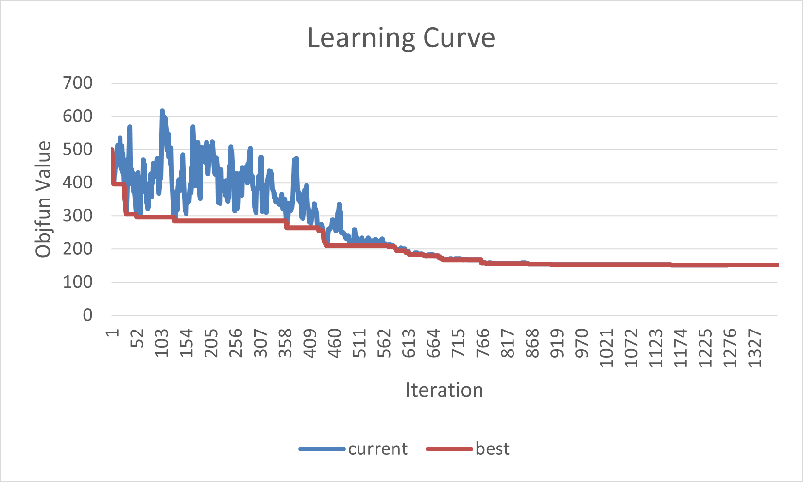

# The-single-machine-total-weighted-tardiness-problem
The single machine total weighted tardiness problem (SMTWTP) is a
well-known NP-hard scheduling problem. There are n jobs to be scheduled
on a single machine that can handle only one job at a time. Each of n
jobs (numbered 1, . . . , n) is to be processed without interruption.
Job *i* ∈ *n* becomes available for processing at time zero, requires an
integer processing time *p**i*, and has a positive weight
*w**i* and a due date *d**i*.  
For a given processing order of the jobs, the (earliest) completion time
*C**i* and the tardiness
*T**i* = *m**a**x*{*C**i* − *d**i*, 0}
of job *i* ∈ (*i* = 1, ..., *n*) can be computed. The objective is to
find a processing order of the jobs that minimizes the total weighted
tardiness:
*m**i**n*∑*i**w**i* × *T**i*.

Data for three example problem instances are provided [here](https://github.com/taylankabbani/The-single-machine-total-weighted-tardiness-problem/tree/master/Data_instances)

## [FirstDescent Algorithm](https://github.com/taylankabbani/The-single-machine-total-weighted-tardiness-problem/blob/master/FirstDescent_algorithm.py)

The developed local search algorithm to solve SMTWTP is described as
follows. The solution presentation is the permutation of n numbers of
the jobs to be done in the set {1, 2,..., n}, where the
*i**th* number in the permutation denotes that the job is
the *i**th* job to be processed. For example, a sequence of
5-job schedules, 5-3-1-2-4 is simply represented as {5,3,1,2,4}. The
initial solution is generated by producing a random schedule of jobs,
and the set of neighboring solutions N(X) is sampled by swap at random
*i**th* and *j**th* number of the current
solution. The first improvement (first descent) strategy move is
applied. The stopping criteria is set to 100 iteration without finding
an improving solution.
| n_jobs |                                                  Initial Solution                                                 | Objfun Value |                                                  Final Solution                                                  | Objfun Value |
|:------:|:-----------------------------------------------------------------------------------------------------------------:|:------------:|:----------------------------------------------------------------------------------------------------------------:|:------------:|
| 10     | [4, 7, 9, 1, 5, 3, 10, 6, 8, 2]                                                                                   | 39           | [4, 7, 9, 5, 3, 8, 6, 10, 1, 2]                                                                                  | 14.660       |
| 20     | [17, 14, 19, 18, 13, 20, 3, 2, 8, 6,  5, 15, 9, 1, 10, 11, 7, 12, 16, 4]                                          | 70.75        | [20, 17, 1, 8, 6, 7, 11, 14, 3, 9,  15, 10, 18, 2, 13, 5, 4, 12, 19, 16]                                         | 47.910       |
| 30     | [13, 2, 25, 24, 21, 22, 23, 6, 28, 27,  3, 5, 8, 18, 15, 14, 9, 30, 29, 26, 10,  20, 17, 1, 19, 11, 7, 12, 16, 4] | 479.4        | [8, 6, 13, 5, 26, 2, 15, 4, 25, 22,  19, 17, 3, 24, 10, 27, 14, 7, 1,30,  29, 28, 18, 21, 9, 23, 20, 16, 11, 12] | 390.3        |

## [Simulated Annealing (SA) algorithm](https://github.com/taylankabbani/The-single-machine-total-weighted-tardiness-problem/blob/master/SA_Algorithm.py)
The swap move is used to develop a Simulated Annealing (SA) algorithm with the following
temperature = 1000, geometric cooling schedule with a cooling rate of 0.99, epoch len
criteria as the temperature achieves a very small value (e.g., 0.001).
SA algorithm is a stochastic algorithm; therefore, in order to evaluate its performance, the
along with the best and worse performance is being reported for each problem instance.

